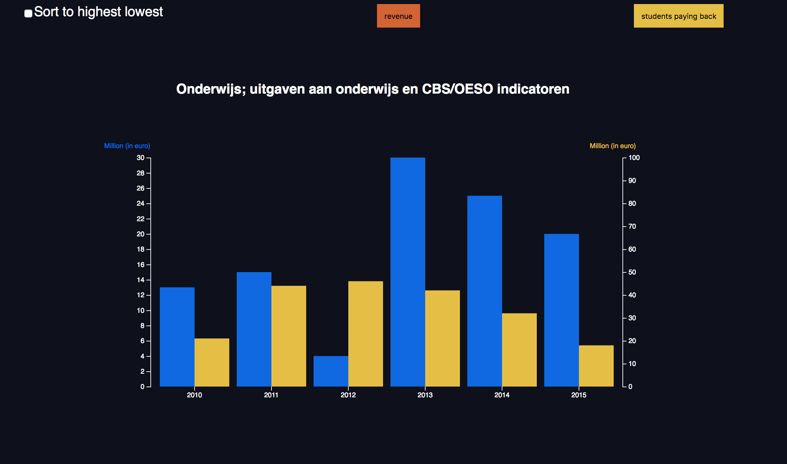

# Assessment 2

This is a assessment i needed to acquire dirty data and make an interactive chart out of the data. What is dirty data? well it's data that is incomplete or has missing values. Which is hard to use out of the box. This assessment is about cleaning the data and using it in a creative way.

## Background

This assessment is to work on the interaction of a chart that uses dirty data. The dirty data you can aquire of recommended links, I used the dirtiest data i could find [from the Central Bureau of Statistics. Eductaion; Goverment spending to education with indication of CBS/OESO](http://statline.cbs.nl/statweb/publication/?vw=t&dm=slnl&pa=80393ned&d1=10,12-13,16-18&d2=4,7&d3=a&hd=150105-1327&hdr=g1,t&stb=g2).

### Did I Do That!?

*	I refactored the code of [liufly](https://github.com/liufly/) of his [.v3 barchart without license.](https://github.com/liufly/Dual-scale-D3-Bar-Chart). From v3 to v4.
*	I used the sorted code from [barchart](https://bl.ocks.org/mbostock/3885705) by [Mike Bostock](https://github.com/mbostock). To rework it a little bit for the barchart.

*	I started out to clean the data so that it is readable and usable data used from: [from the Central Bureau of Statistics. Eductaion; Goverment spending to education with indication of CBS/OESO](http://statline.cbs.nl/statweb/publication/?vw=t&dm=slnl&pa=80393ned&d1=10,12-13,16-18&d2=4,7&d3=a&hd=150105-1327&hdr=g1,t&stb=g2). 

*	Then i made the data fit i used the data from 2010 - 2015 to delete the data that i didn't need. I already refactored the v3 to v4 and made variables dynamic so i could just paste it and fix the little parts.

*	When the sorting worked i created a `update()` function for every click on the button you change the bar with it's values that goes for color, values en and axis. 

*	After that mostly styled my bars in Javascript. And the background and well everything else in CSS

### Features

[**d3 API**](https://github.com/d3/d3/blob/master/API.md)
-   [`d3.axisBottom() , d3.axisLeft() and d3.axisRight()`](https://github.com/d3/d3-axis/blob/master/README.md)
-   [`d3.scaleOrdinal()`](https://github.com/d3/d3-3.x-api-reference/blob/master/Ordinal-Scales.md#ordinal)
-   [`d3.extent()`](https://github.com/d3/d3-array/blob/master/README.md#extent)
-   [`d3.scaleLinear()`](https://github.com/d3/d3-scale/blob/master/README.md#scaleLinear)
-   [`d3.enter()`](https://github.com/d3/d3-selection/blob/master/README.md#selection_enter)
-   [`d3.csvParseRows()`](https://github.com/d3/d3-dsv/blob/master/README.md#csvParseRows)
-   [`d3.text()`](https://github.com/d3/d3-request/blob/master/README.md#text)
-   [`d3.exit()`](https://github.com/d3/d3-selection/blob/master/README.md#selection_exit)

### License

Check the work of: 
* [Mike Bostock](https://github.com/mbostock)
*	[liufly](https://github.com/liufly/)

I used [@liufly](https://github.com/liufly/) [.v3 barchart without license.](https://github.com/liufly/Dual-scale-D3-Bar-Chart) and refactored it to v4 and added interactivity.

For the animation bit of my code i used the sort [barchart](https://bl.ocks.org/mbostock/3885705) by [Mike Bostock](https://github.com/mbostock) [GPLv3](https://opensource.org/licenses/GPL-3.0).

[GPLv3](https://choosealicense.com/licenses/gpl-3.0/) Vincent Kempers 👨🏽‍💻
